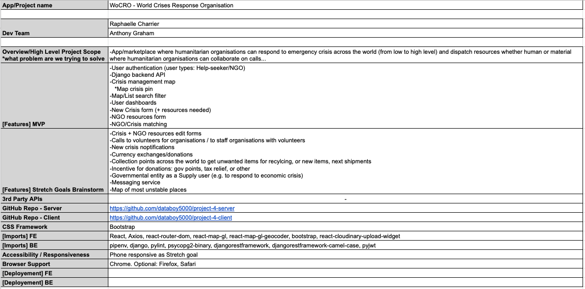
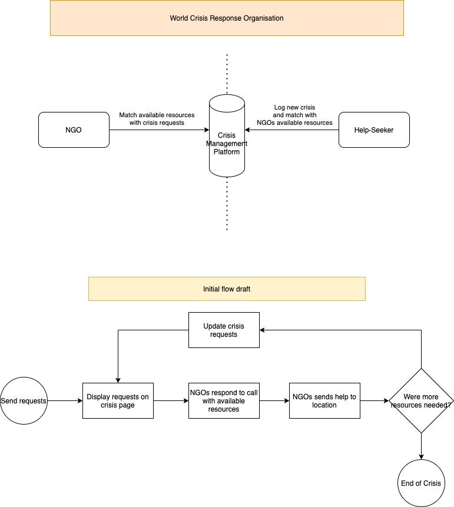
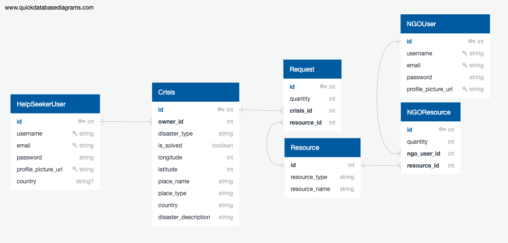
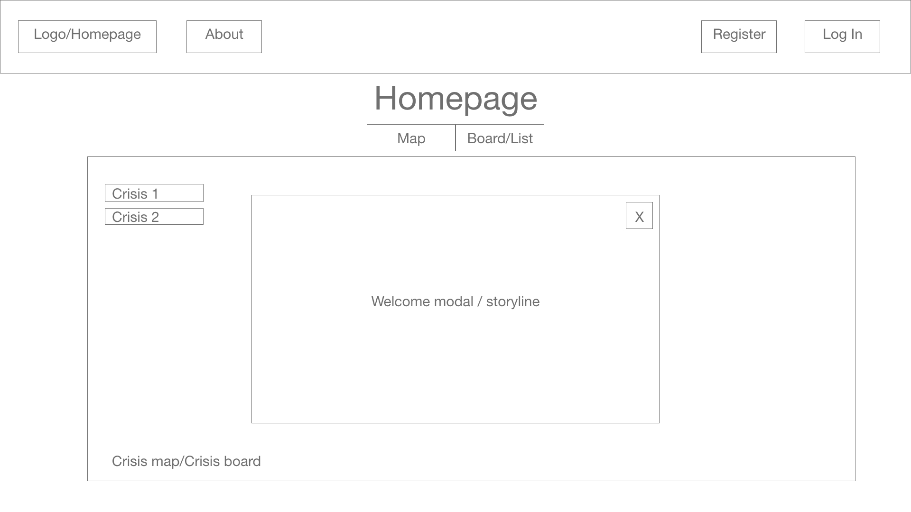
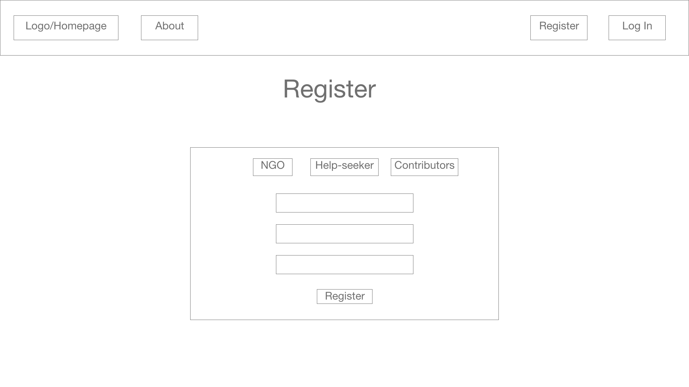
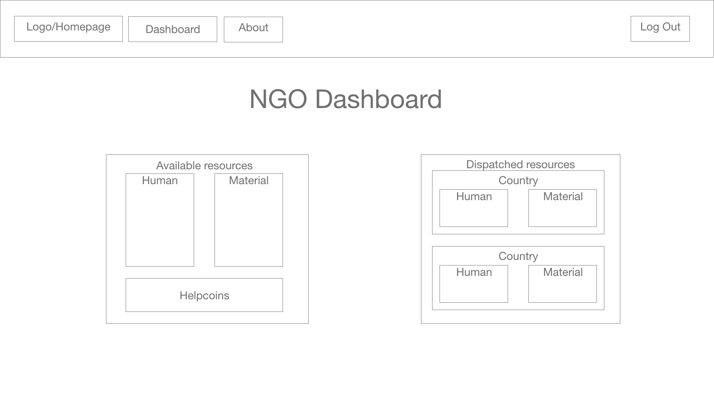

#  Project #4: WoCRO
## World Crisis Response Organisation

by [Raphaëlle Charrier](https://github.com/RaphaelleC) and [Anthony Graham](https://github.com/databoy5000/).

WoCRO is an app for Help-seekers (governmental entities) and NGOs to log major world crises into one place to collaborate efficently on solving them.


## Live Demo & Useful Links

<div style="text-align:center">
  
</div>

<div style="text-align:center">
  
</div>

<div style="text-align:center">
  
</div>

<div style="text-align:center">
  
</div>

## Contents

- [Project Brief](#project-brief)
- [Approach](#approach)
- [Technologies](#technologies-used)
- [Wireframes](#wireframes)
- [Responsibilities](#responsibilities)
- [Key Learnings](#key-learnings)
- [Achievements](#achievements)
- [Challenges](#challenges)
- [Conclusions](#conclusions)

## Project Brief

* **Build a full-stack application** by making your own backend and your own front-end
* **Use a Python Django API** using Django REST Framework to serve your data from a Postgres database
* **Consume your API with a separate front-end** built with React
* **Be a complete product** which most likely means multiple relationships and CRUD functionality for at least a couple of models
* **Implement thoughtful user stories/wireframes** that are significant enough to help you know which features are core MVP and which you can cut
* **Have a visually impressive design** to kick your portfolio up a notch and have something to wow future clients & employers. **ALLOW** time for this.
* **Be deployed online** so it's publicly accessible.

## Approach
To guarantee continuity during the project build, we established the following elements:
* To assure communications on a messaging app where we could write, talk, exchange resources and share screens.
* [Project Management Sheet](https://docs.google.com/spreadsheets/d/1g-ZKAiVj09dBAaLHXUu5pl-V6kxmzfIp10CzKzqRgqc/view): to document the project scope and all specifications to the app into a single shared space.

(Sample of the main specifications tab)
<center>
  
</center><br>

Then, we defined the following milestones:
1. Establish database collections, their relationships and validated diagram.
2. Define API endpoints.
3. Construct wireframes.
4. Build cycle
    - Task planning/coordinating
    - Code
    - Test
    - Fix errors
    - Push working feature to GitHub
5. Syle completed components/pages
6. Final tests to validate app flow and design finishing
7. Backend & Frontend deployment

During the <ins>build cycle</ins>, we worked our way linearly from the back-end to the front-end, clearly defining tasks (one or multiple complete features per task) between team members to work through them separately in order to have minimum overlap, avoiding merge conflicts and/or work being done twice.

## Technologies Used

### <ins>Back-end</ins>
<br>
<br>


#### Additional technologies:
* TablePlus
* pyjwt
* pipenv
* pylint
* DjangoREST camel case

### <ins>Front-end</ins>
<br>
<br>
<br>


#### Additional technologies:
* SASS
* Axios
* Cloudinary
* React MapGL
* React MapGL Geocoder

## Project Planning Diagrams

### <ins>Flow Chart</ins>
Setting the flow chart helped us to brainstorm our way from a few different ideas to a sustainable one, and allowing us to manage expectations during the build across the team.

<center></center>

### <ins>Entity Relationship Diagram</ins>
<center></center>

### <ins>Wireframes</ins>
The wireframes include features which we thought could be part of our MVP. We quickly realised - whilst working our way through the back end - that we had to make things simpler to complete our MVP within the given deadline.

#### <center><ins>Homepage</ins></center>
<center></center>

#### <center><ins>Register Form</ins></center>
<center>
  
</center>

#### <center><ins>New Crisis Form</ins></center>
<center>
  
</center>

#### <center><ins>NGO Dashboard</ins></center>
<center>
  
</center>


## Responsibilities
This project was a great team effort of bringing things together as a pair, but let's take a look at the elements which I configured...

### <ins>Back-end (crises app)</ins>

#### 1. Models
The following subclasses were matched with the ERD, inheriting from `django.db.models.Model` class (to access to the class's attributes for creating the database fields):
- Crisis
- Request
- Resource
- NGOResource

Some specific fields required to be channeled through a selection of values. The documentation recommended we implement the following to declare a list of available choices (e.g. `Crisis`):
```py
    TSUNAMI = 'Tsunami'
    HURRICANE = 'Hurricane'
    FLOOD = 'Flood'
    EARTHQUAKE = 'Earthquake'
    WAR = 'War'
    PANDEMIC = 'Pandemic'
    WILDFIRE = 'Wildfire'

    DISASTER_TYPES = [
        (TSUNAMI, 'Tsunami'),
        (HURRICANE, 'Hurricane'),
        (FLOOD, 'Flood'),
        (EARTHQUAKE, 'Earthquake'),
        (WAR, 'War'),
        (PANDEMIC, 'Pandemic'),
        (WILDFIRE, 'Wildfire')
    ]

    disaster_type = models.CharField(
        max_length=20,
        choices=DISASTER_TYPES,
    )
```

#### 2. URLs & Views
We followed the CRUD pattern to read all crises & single crisis, create, update and delete, for crises and NGO resources separately. Additionally, I personalised the backend by adding enpoints to serve specific tasks for better interaction continuity between the front & back ends. Let's take a look at the URLs:

```py
urlpatterns = [
    path('', CrisisListView.as_view()),
    path('types/', DisasterTypesListView.as_view()),
    path('<int:user_pk>/', UserCrisisListView.as_view()),
    path('crisis/<int:crisis_pk>/', CrisisDetailView.as_view()),
    path('request/<int:crisis_request_pk>/', RequestDetailView.as_view()),
    path('resources/', ResourceListView.as_view()),
    path('ngo_resources/<int:resource_pk>/', NGOResourceDetailView.as_view()),
    path('ngo_resources/', NGOResourceListView.as_view()),
]
```
Here is a condensed breakdown of the personnalised urls:

  - `DisasterTypesListView`: calls the custom `Crisis` model method `get_disaster_types()` to be used at the front-end's create & update forms. That way, the single point to ammend - when more disaster types are added to the list - is the back-end's model list of choices.
  - `RequestDetailView`: updates a single existing crisis request. The front end form will only send a put request to updated request values.
  - `ResourceListView`: calls the list of resource values in the Resource model, with the same idea to optimize as the first point (scalability).

#### 3. Serialization

  - <ins>Crisis</ins>

What we wanted was to create a crisis within a single request. That way, if for some reason there was an interruption during the create request, the crisis object wouldn't get validated and therefore keep the database clean from unfinished and/or duplicate objects.

To help understand the process, here is a diagram where:
  - Request: refers to the model
  - **requests** (bold): referes to the crisis dictionary key named requests, which are resources 'requests'.
  - request (not bold): refers to client request.

<center>
  
</center>

  - <ins>NGOResource</ins>


### <ins>Back-end (jwt_auth)</ins>


### <ins>Front-end</ins>


## Key Learnings

## Achievements

## Challenges

## Conclusions
