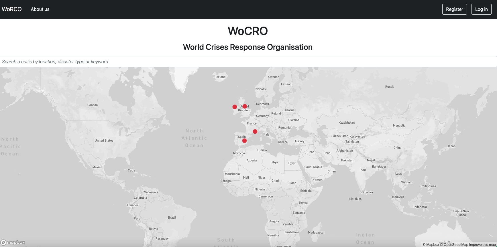

# Project 3: Memory.map
by [Antoinette Demonceaux](https://github.com/Ant0inette), [Kat Hackethal](https://github.com/khackethal/) and [Anthony Graham](https://github.com/databoy5000/).

Memory.map is a platform to connect with places and cities, through people.

Share memories on a map-based platform, track down urban legends, ancestry & much more.

## Contents

- [Contents](#contents)
- [Brief](#brief)
- [Approach](#approach)
- [Technologies Used](#technologies-used)
- [Wireframe](#wireframe)
- [Responsibilities](#responsibilities)
- [Key Learnings](#key-learnings)
- [Achievements](#achievements)
- [Challenges](#challenges)
- [Conclusions](#conclusions)

## Brief

* **Build a full-stack application** by making your own backend and your own front-end
* **Use an Express API** to serve your data from a Mongo database
* **Consume your API with a separate front-end** built with React
* **Be a complete product** which most likely means multiple relationships and CRUD functionality for at least a couple of models
* **Implement thoughtful user stories/wireframes** that are significant enough to help you know which features are core MVP and which you can cut
* **Have a visually impressive design** to kick your portfolio up a notch and have something to wow future clients & employers. **ALLOW** time for this.
* **Be deployed online** so it's publicly accessible.

## Approach
From the off, we established the following elements to guarantee continuity during the project build:

### Communication
To be assured on a messaging app where developpers can write & talk to each other, exchange resources and share screens.

### Project Scope
We use a spreadsheet program ([see here](https://docs.google.com/spreadsheets/d/17YFoGBlmBzowzMGTn-n-OWcBpImDZlBbY4UEJlJJn4I/edit?usp=sharing)) to allow us to manage the project across all team members, into one organised place. We use the following tabs:
- App Specifications: to articulate the project's objectives & milestones, outline constraints and to store any shareable resources (github links, libraries, third party API documentation)
- Tasks Board: where we defined each team member's tasks to tick off and pick the next.
- API: where we defined Memory.map's models and CRUD operations.
- Naming Conventions: to keep code readability and continuity across the project.

### Building
We chose to work our way linearly from the back-end to the front-end, but clearly defining tasks between developpers to work through tasks in parallel, in order to have minimum overlap and avoid confusion (e.g. working similar files).

## Technologies Used

- HTML
- CSS/Sass
- JavaScript
- React
- Node.js,
- Mongoose
- Mongoose Unique Validator
- Mongoose Hidden
- Express
- Cloudinary
- Axios
- bcrypt
- Json Web Token
- React Map GL
- React Map GL Geocoder
- Moment
- React Confirm Alert
- Bulma framework

## Wireframe

## Responsibilities

### Cloudinary

### User Preferences

## Key Learnings

## Achievements

## Challenges

## Conclusions

